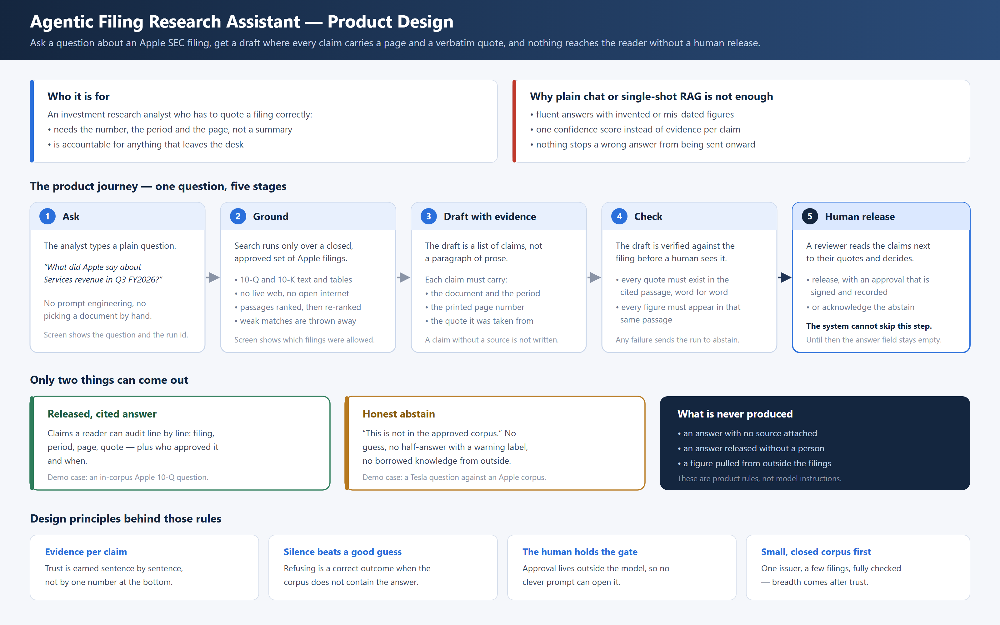
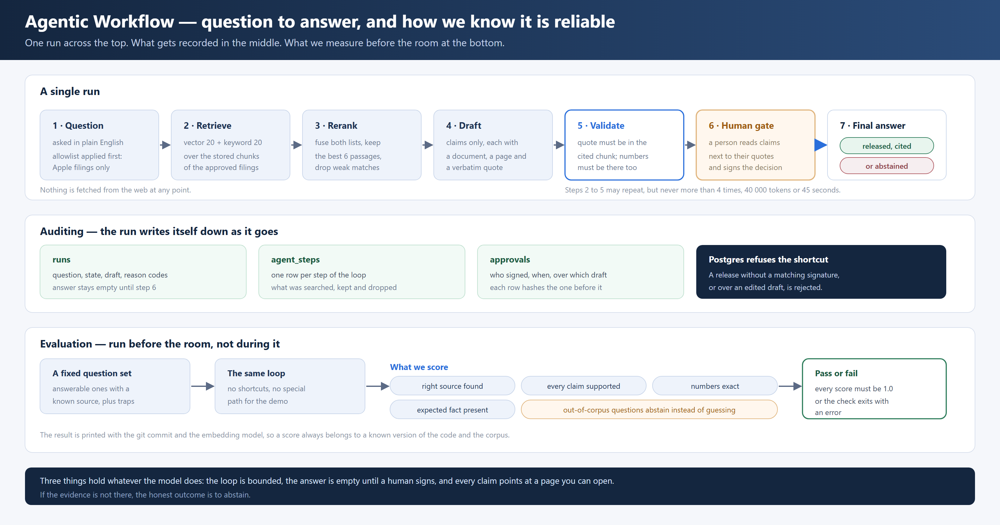

# Mawer

Allowlisted **Apple 10-Q** question answering: hybrid retrieve, a bounded agent loop, claim-level citations, numeric checks, and mandatory human release. The model does not own control — Python, the corpus manifest, and HITL HMAC do.

The binding contract is [`docs/AGENTIC_RAG_SPEC.md`](docs/AGENTIC_RAG_SPEC.md). Product and technical diagrams live in [`docs/diagrams/`](docs/diagrams/README.md).



## What ships

| Layer | Behavior |
| --- | --- |
| Corpus | Three Apple 10-Qs, 204 chunks, local BGE 384-d vectors |
| Retrieve | Vector 20 + keyword 20 → weighted RRF (`k=60`, cap 30) → cloud rerank top 6, or RRF-only |
| Agent | Tools are only `search_chunks`, `get_chunk`, `get_document_meta`. Limits: 4 steps, 40k tokens, 45s |
| Grounding | Quotes must match allowlisted chunks; every number must appear in the cited quote; citation metadata is rebuilt in Python |
| HITL | `answer` stays null until a signed approval. `RELEASED` / `ABSTAINED` need a fresh HMAC and a legal SQL state transition |

The agent never downloads source URLs at query time and never returns unallowlisted chunks. Out-of-corpus questions (for example Tesla) must abstain.

## Quick start

Python **3.12+** (not the Windows Store stub).

```powershell
py -3.12 -m venv .venv
.\.venv\Scripts\Activate.ps1
pip install -r requirements.txt
Copy-Item .env.example .env   # then fill Neon / API keys if you have them
python run_demo.py
```

Open [http://127.0.0.1:8000/](http://127.0.0.1:8000/). Workshop PIN: **2026**.

`run_demo.py` loads `.env` then `.env.local`. With `DATABASE_URL` and `HITL_SIGNING_KEY`, it uses Neon `documents`, `chunks`, `runs`, `agent_steps`, and `approvals`. If Neon is down, it falls back to the committed processed corpus and an in-memory run store. HITL still applies in both modes.

No OpenAI key is required for ingest, retrieval, or the extractive fallback. Optional OpenAI/Gemini enables JSON drafting; Cohere/Jina enables cloud rerank. Missing vendors fall back to RRF and extractive claims.

## Corpus

Authoritative files are in `data/processed/`. Query-time allowlist: [`data/corpus_manifest.json`](data/corpus_manifest.json).

| Filing | Period | Pages | Chunks |
| --- | --- | --- | --- |
| `AAPL_10-Q_2025-12-27` | fiscal Q1 2026 | 24 | 61 |
| `AAPL_10-Q_2026-03-28` | fiscal Q2 2026 | 28 | 72 |
| `AAPL_10-Q_2026-06-27` | fiscal Q3 2026 | 28 | 71 |

Each document includes source tables, exact citable `raw_text`, and `embeddings_bge.npz`. Vectors are already committed. To regenerate them from processed text (no PDF reparse):

```powershell
$env:PYTHONPATH = "src"
python -m finembed embed-bge
```

Load the same corpus into Neon:

```powershell
python scripts/init_cloud_db.py
python -m finembed embed-neon
```

## How a run works



1. Scope to an explicit filing period, or the latest 10-Q.
2. Hybrid retrieve over the allowlist only.
3. Draft claims with quotes (LLM if keyed, otherwise extractive).
4. Validate quotes and numbers in code.
5. Park in `AWAITING_HUMAN` until PIN + HMAC approval, then `RELEASED` or `ABSTAINED`.

Technical layout: [`docs/diagrams/technical-architecture.png`](docs/diagrams/technical-architecture.png). Runtime topology: [`docs/RUNNING_ENVIRONMENT.md`](docs/RUNNING_ENVIRONMENT.md).

## Verify

```powershell
python -m pytest -q
python src/eval/run_eval.py
python src/eval/run_agent_eval.py
```

- `pytest` covers retrieve, agent, HITL, and the happy path.
- `run_eval.py` scores all **18** retrieval / abstain questions in `eval/questions.jsonl`.
- `run_agent_eval.py` runs BGE → hybrid retrieve → draft → validate and reports citation hit, claim support, numeric exactness, fact hit, and abstain quality.

## Configuration

Copy [`.env.example`](.env.example). Do not commit `.env` or `.env.local`.

| Variable | Role |
| --- | --- |
| `DATABASE_URL` | Neon pooled URI (`sslmode=require`). Omit for local corpus fallback |
| `HITL_SIGNING_KEY` | HMAC key for approvals |
| `HITL_PIN` | Demo PIN (default `2026`) |
| `COHERE_API_KEY` / `JINA_API_KEY` | Cloud rerank; blank → RRF-only |
| `OPENAI_API_KEY` / `GEMINI_API_KEY` | Optional JSON drafting |

## Docs

| Doc | Use |
| --- | --- |
| [`docs/AGENTIC_RAG_SPEC.md`](docs/AGENTIC_RAG_SPEC.md) | Binding product and control contract |
| [`docs/TECHNICAL_SOLUTION.md`](docs/TECHNICAL_SOLUTION.md) | How the repo implements the spec |
| [`docs/RUNNING_ENVIRONMENT.md`](docs/RUNNING_ENVIRONMENT.md) | Talk laptop + Neon + rerank topology |
| [`docs/diagrams/`](docs/diagrams/README.md) | Workshop slides (SVG source + PNG) |
| [`eval/metrics.md`](eval/metrics.md) | What the eval scores mean |
